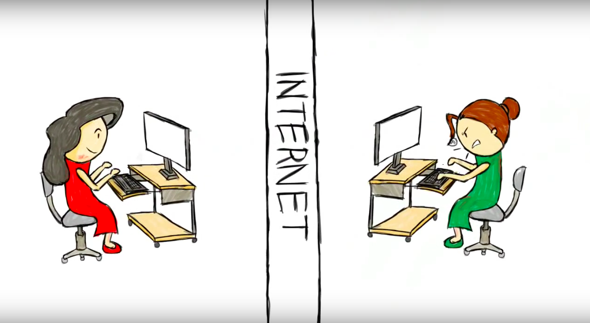

[<<< Previous](accessibility.md) | [Next >>>](power.md)

# Level of Impact I: Direct Impacts on People through Data Collection

## Direct effects on people

> "At the most basic level of an impact approach, we might ask **how our methods of data collection impact humans, directly.** If one is interviewing, or the data is visibly connected to a person, this is easy to see. But a distance principle might help us recognize that when the data is very distant from where it originated, it can seem disconnected from persons, or what some regulators call ‘human subjects.’" ([Annette Markham, "OKCupid data release fiasco: It’s time to rethink ethics education," 2016](http://annettemarkham.com/2016/05/okcupid-data-release-fiasco-its-time-to-rethink-ethics-education/), emphasis added)  

## What counts as "human"? What data should be off limits?
 
Some commonly blurred definitions, according to the 2012 Ethical Decision-Making and Internet Research report by the the AoIR Ethics Working Committee:  

* “Human subjects”:

> "The definition of ‘human subject’ has become, unfortunately, a litmus test for whether or not one needs to undergo ethical review before conducting research... ‘human subject’ has never been a good fit for describing many internet-based research environments... when considered outside a regulatory framework, **the concept of ‘human subject’ may not be as relevant as other terms such as harm, vulnerability, personally identifiable information, and so forth.**"  

* Public vs. private:  

> "Individual and cultural definitions and expectations of privacy are ambiguous, contested, and changing. People may operate in public spaces but maintain strong perceptions or expectations of privacy. Or, they may acknowledge that the substance of their communication is public, but that the specific context in which it appears implies restrictions on how that information is-or ought to be- used by other parties. **Data aggregators or search tools make information accessible to a wider public than what might have been originally intended.**" 

* Data(text) vs. persons:

> "Is an avatar a person? Is one’s digital information an extension of the self? ... Can we assume a person is wholly removed from large data pools? ... there is considerable evidence that even ‘anonymised’ datasets that contain enough personal information can result in individuals being identifiable ... **Does the connection between one’s online data and his or her physical person enable psychological, economic, or physical, harm?** One way of evaluating the extent to which these ethical dilemmas may be hidden is to focus on the way that procedures for data collection or analysis extract data from lived experience."  

Source: [the 2012 Ethical Decision-Making and Internet Research report by the AoIR Ethics Working Committee](http://aoir.org/reports/ethics2.pdf), emphases added    

## Human subjects & the “distance principle”

A working definition of the “distance principle”:

> "**the extent to which Internet texts or data sets might connect to persons** [even when] the conceptual or experiential distance between the researcher and author/participant [does not appear to be] close" ([Annette Markam & Elizabeth Buchanon, “Ethical Concerns in Internet Research”](https://www.academia.edu/8037870/Ethical_Concerns_in_Internet_Research), page 10, emphasis added)  

  

Image source: A still image from ["A real person, a lot like you"](https://www.youtube.com/watch?v=cfwwHa-7Ux8) by [Derek Sivers](https://sivers.org/), shared here with his permission.  

> Anonoymous data Vs de-identifed 
ADD DEFINitions
[These are the actual locations for millions of Americans.]https://www.nytimes.com/interactive/2019/12/19/opinion/location-tracking-cell-phone.html 
## “Public” data

Some questions to consider:  

> "In an age of digital media, do we really have any privacy?" ([Susan Barnes, “A Privacy Paradox,” 2006](http://firstmonday.org/article/view/1394/1312))  

- How do we delineate between "research" vs. "spying"?  Does this change when the project focuses on "big data"? (see [Berendt, Büchler, & Rockwell, “Is it Research or is it Spying? Thinking-Through Ethics in Big Data AI and Other Knowledge Sciences,” 2015](https://people.cs.kuleuven.be/~bettina.berendt/Papers/berendt_buechler_rockwell_KUIN_2015.pdf))
- What forms of "public" data are ethical to use? Or require attribution?
- How might we (intentionally or inadvertently) share data?

For those doing work with big data, recommended reading: [Matthew Zook et al., "Ten simple rules for responsible big data research," 2017](http://journals.plos.org/ploscompbiol/article?id=10.1371/journal.pcbi.1005399)  

## The question of personhood

Some questions to consider:  

> "Is an avatar a person?"  
> "Is one’s digital information [e.g. photos, videos, audio, social media posts] an extension of the self?"  
> "Can we assume a person is wholly removed from large data pools?" *Note: "there is considerable evidence that even ‘anonymised’ datasets that contain enough personal information can result in individuals being identifiable"*  
> "Does the connection between one’s online data and [their] physical person enable psychological, economic, or physical, harm?"     

Source: [the 2012 Ethical Decision-Making and Internet Research report by the the AoIR Ethics Working Committee](http://aoir.org/reports/ethics2.pdf)  

## Activity  

Let's analyze and discuss a case study.  

Review Joshua Tabak and Vivian Zayas's [academic article](http://journals.plos.org/plosone/article?id=10.1371/journal.pone.0036671) and [their summary of it for the New York Times](http://www.nytimes.com/2012/06/03/opinion/sunday/the-science-of-gaydar.html), and discuss:

* What kinds of “human subjects” are involved in this study?
* Is a social media photo of oneself an extension of the self? 
* Does their methodology raise any ethical concerns?

Discuss with your table, then share as a group.  

Further reading: [Patrick Sweeney, "Images of Faces Gleaned from Social Media in Social Psychological Research on Sexual Orientation," 2017](https://www.academia.edu/34001772/Images_of_Faces_Gleaned_from_Social_Media_in_Social_Psychological_Research_on_Sexual_Orientation)   

[<<< Previous](accessibility.md) | [Next >>>](power.md)
-----
[Return to introduction](https://github.com/SouthernMethodistUniversity/access)
