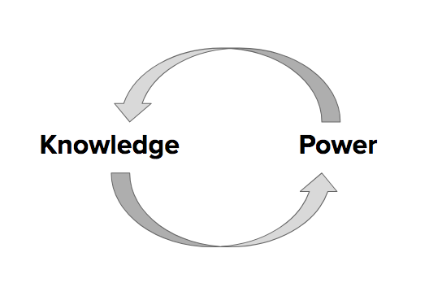
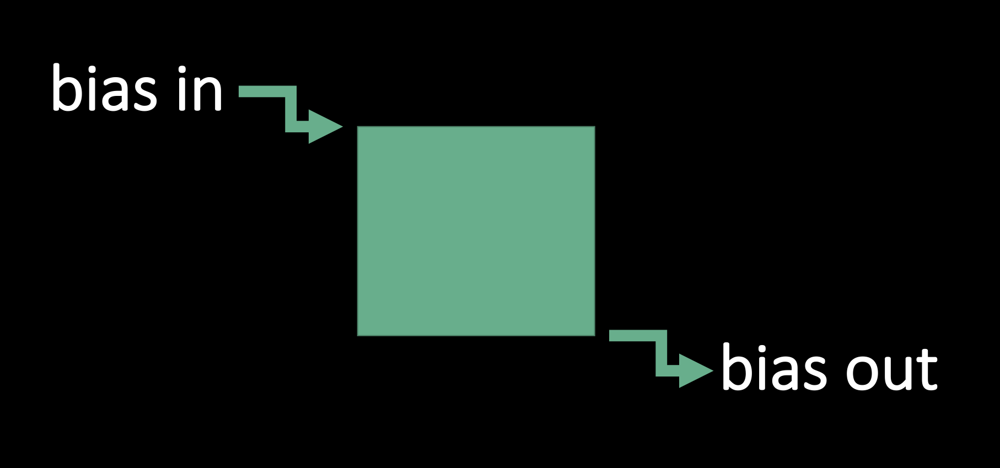

[<<< Previous](people.md) | [Next >>>](socpol.md)

# Level of Impact II: Politics of knowledge production and categorization  

## Politics of knowledge production

> "At another level, we can ask how our methods of organizing data, analytical interpretations, or findings as shared datasets are being used — or might be used — **to build definitional categories or to profile particular groups** in ways that could impact livelihoods or lives. Are we contributing positive or negative categorizations?" ([Annette Markham, "OKCupid data release fiasco: It’s time to rethink ethics education," 2016](http://annettemarkham.com/2016/05/okcupid-data-release-fiasco-its-time-to-rethink-ethics-education/), emphasis added)  

  
Image source: Created by author in MS Word.  

## Discussion prompts 

We can discuss as a group:  

- *BRIEFLY,* how are knowledge and power mutually constituted, according to the theorizations of Gramsci, Hall, Foucault, or others, perhaps from your own discipline?
- How might we apply the concepts below when thinking through ethics for digital research and projects?  

Some key concepts:

**Hegemony** (Antonio Gramsci)  
> “The ability of a dominant group to create [majority] consent and agreement [around a particular system of meanings] within a population without the use or threat of force” (Kenneth Guest, *Cultural Anthropology: A Toolkit for a Global Age*, 2014, page 52)

**Discourse** (Michel Foucault)  
* Discourses are competing ideologies (or individualized groups of statements), constructed by people and institutions in power over time, that become dominant amongst societies of people. Discourses produce knowledge in mediums that a society perceives as normative and generally does not question; in doing so, discourses pervasively shape how the people in that society think, act, and react (see Michel Foucault, *The Archaeology of Knowledge and the Discourse on Language*, 1969). 

**"Policing the crisis"** (Stuart Hall)  
* "Policing the crisis" refers to the unnatural process by which certain actions (by certain people) become and continue to be understood, reported, policed, and sanctioned as a type of "crime." The police, the judicial system, and mainstream media "are actively and continuously part of [this] whole process" (Stuart Hall et al., *Policing the Crisis*, 2013 [1978], page 54). Hall et al. focus on the emergence of "mugging" and its attendant social panic in Britain, beginning in the early 1970s.  

For further readings, see the section "Key works (among many more!) on the politics of knowledge production and forms of knowledge" on the [Continue page](continue.md) at the end of this workshop.

### An example:

The hegemonic racial discourses that associate Blackness with criminality in the United States serve to justify police brutality towards and higher rates of criminalization and mass incarceration of Black people — and these higher rates of policing and incarcerating serve to justify the assumption of their criminality.

So then when, for example, someone attempts to make an algorithm to identify potential criminals that is produced through machine learning on "crime" data (e.g. the number of arrests or convictions in relation to demographic data) that algorithm will reproduce the racist ideologies and practices that lead to the policing and incarcerating of Black people at a much higher rate.

Further reading: [Julia Angwen and Jeff Larson, "Bias in Criminal Risk Scores Is Mathematically Inevitable, Researchers Say," 2016](https://www.propublica.org/article/bias-in-criminal-risk-scores-is-mathematically-inevitable-researchers-say)

## The ramifications of (re)producing categories

Decisions on the categories and boundaries scholars use shape our:

- Datasets
- Catalogues
- Maps
- Algorithms

Categories are key to digital tools in many ways: the classification systems used by libraries and archives, the tags used on websites, the methods of categorization informing algorithms, and the spatial divisions on a map. The production and reproduction of these categories shapes how things/people/places, etc., are identified and grouped together, and also what is searchable, findable, and foregrounded.

  

Image source: A comic by Adeline Koh from [#DHPoco: Postcolonial Digital Humanities](http://dhpoco.tumblr.com/), shared here with her permission.  

## Bias in, bias out: Systems of oppression and inputting human bias

**Human beings** are making decisions that inform how these groupings are being made, and human "beliefs are embedded in the design and concept of technological systems" (Broussard, 2018, page 67). Technology is not unbiased, but rather will inevitably represent the decisions of its human creators who each create from their own situated standpoints — personally, socially, and historically.  

The United States, for example, is a society shaped by dominant systems of oppression such as *white supremacy*, *settler colonialism*, and *cis-hetero-patriarchy* (see the [Glossary](https://github.com/SouthernMethodistUniversity/access/blob/master/sections/continue.md#glossary) for definitions). These oppressive systems affect — sometimes intentionally, sometimes not — the decisions people make when they create digital platforms or tools (or anything for that matter!) and the parameters of what is permitted/supported/funded to be created and shared, and thus also shape the output that results from these digital platforms or tools or their computations. 

> "Writing a presentation on library cataloging and classification & realizing that there is nothing serendipitous about serendipitous browsing. As with everything else, someone *decided* where the book you found on the shelf would land. Someone with biases because we all have them," (Jenna Freedman @zinelib on Twitter, shared here with her permission. Also see: [Jenna Freedman, "Library Cataloging and Classification: Reifying the Default," 2018](https://lowereastsidelibrarian.info/talks/2018/moma))  

> "Human beings are developing the digital platforms we use, and as I present evidence of the recklessness and lack of regard that is often shown to women and people of color in some of the output of these systems, it will become increasingly difficult for technology companies to separate their systematic and inequitable employment practices, and the far-right ideological bents of some of their employees, from the products they make for the public." (Safiya Umoja Noble, *Algorithms of Oppression: How Search Engines Reinforce Racism*, 2018, page 2; see also Meredith Broussard, *Artificial Unintelligence: How Computers Misunderstand the World*, chapter six, 2018)  

In the fields of Artificial Intelligence (AI) and Data Science, the phrase ["junk in, junk out"](https://medium.com/source-institute/with-ai-and-data-its-junk-in-junk-out-18b33e8f391e) (Eric David Halsey, 2017), is used to describe the the fact that predictive models take into account the data that is provided to them by their human creators, and then extrapolate to possible futures. Often this data is incomplete, faulty, or messy in a way in which the results are considered "junk," because the data input to the model was "junk." 

While decisions made by algorithms are often presented as free of the personal value judgments that a loan officer or judge might apply to loan candidates or in determining the length of a prisoner's sentence, for example, they can still reproduce the bias evident in the data the algorithm is trained on. Many scholars and activists have also critiqued the use of existing data on policing, arrests, and recidivism in algorithms that try to predict future criminal behavior. Because the data being input to the model is based on past policing practices that include the over-policing of communities of color and low-income people, that data is biased against those groups and thus will reproduce the existing bias in its predictions of future activities. For a deeper dive, you can read more in [this article](https://www.theverge.com/2016/2/3/10895804/st-louis-police-hunchlab-predictive-policing-marshall-project) (Maurice Chammah, 2016) that shows how predictive policing is *not* value-free and unbiased.  

Image source: Created by Kelsey Chatlosh in MS PowerPoint.  

*[Explain xkcd 1838](https://www.explainxkcd.com/wiki/index.php/1838:_Machine_Learning)

"Civil rights experts say Williams is the **first documented example in the U.S. of someone being wrongfully arrested based on a false hit produced by facial recognition technology.** What makes Williams' case extraordinary is that police admitted that facial recognition technology, conducted by Michigan State Police in a crime lab at the request of the Detroit Police Department, prompted the arrest, according to charging documents reviewed by NPR. The pursuit of Williams as a possible suspect came despite repeated claims by him and his lawyers that the match generated by artificial intelligence was faulty." -[The Computer Got It Wrong': How Facial Recognition Led To False Arrest Of Black Man](https://www.npr.org/2020/06/24/882683463/the-computer-got-it-wrong-how-facial-recognition-led-to-a-false-arrest-in-michig)

*[Explain xkcd 2494](https://explainxkcd.com/wiki/index.php/2494:_Flawed_Data)

"A Black woman at my university once told me that whenever she used Proctorio's test proctoring software, it always prompted her to shine more light on her face. The software couldn’t validate her identity and she was denied access to tests so often that she had to go to her professor to make other arrangements. Her white peers never had this problem."[Software that monitors students during tests perpetuates inequality and violates their privacy](https://www.technologyreview.com/2020/08/07/1006132/software-algorithms-proctoring-online-tests-ai-ethics/)

## Attempts to "resist the hierarchy"  

A question to consider:

* Can categorical hierarchies and existing bias be resisted through digital projects? If such resistance is possible, how can it be achieved?

As scholars, we have a responsibility to think critically about how we do or do not reproduce existing biases in the canons we reference, the data we use, and the conclusions we reach. Some projects that have tried to produce new, less-biased representations include: 

- [The #StandingRockSyllabus](https://nycstandswithstandingrock.wordpress.com/standingrocksyllabus/) 
- [#BLM syllabus](http://www.blacklivesmattersyllabus.com/)
- [Ferguson syllabus](https://sociologistsforjustice.org/ferguson-syllabus/)
- [The Zine Librarians Code of Ethics](http://zinelibraries.info/code-of-ethics/)  
- [Native-Land.ca (mapping project)](https://native-land.ca/)  
- [Invasion of America: How the United States Took Over an Eighth of the World (mapping project)](http://usg.maps.arcgis.com/apps/webappviewer/index.html?id=eb6ca76e008543a89349ff2517db47e6)
- [Bearing Witness: The Covid-19 & Inequality History Documentation Project](https://bearingwitness.github.io/)

## A case study.  

Check out the [Interference Archive (IA) website](http://interferencearchive.org/), read [this brief article](http://technical.ly/brooklyn/2016/11/28/interference-archive-activism-jen-hoyer/%20) and discuss:  

* What kinds of materials does IA host and do they have rights to it?
* In reference to the article, how does IA see itself as “resisting the hierarchy”?
* What levels of impact does IA aim to take into account?  

[<<< Previous](people.md) | [Next >>>](socpol.md)
-----
[Return to introduction](https://github.com/SouthernMethodistUniversity/access)
